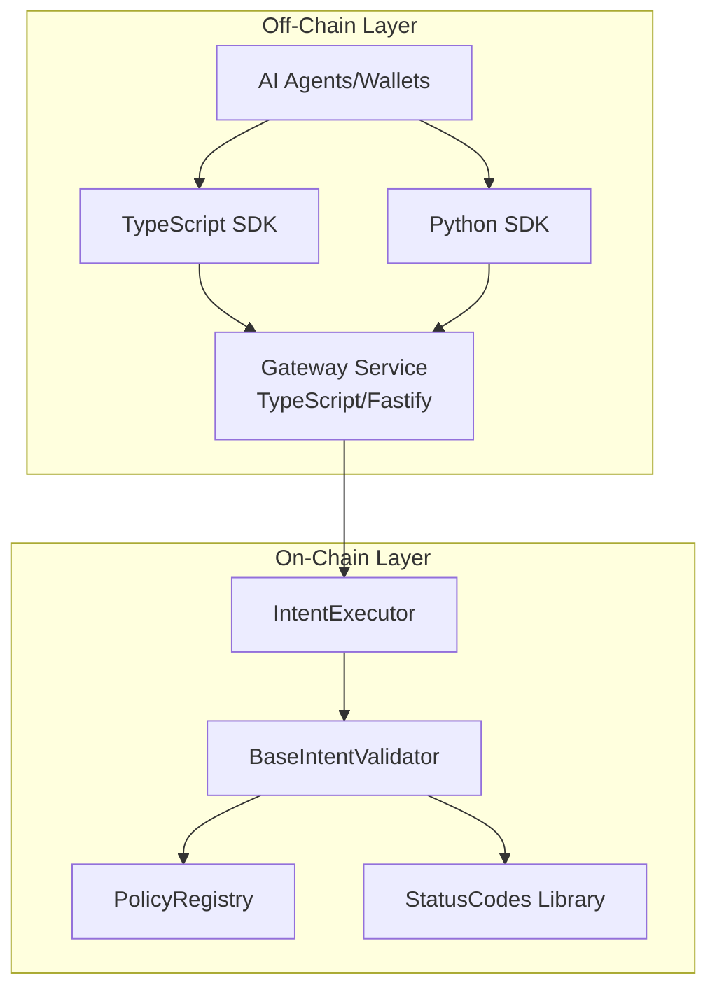

<div align="center">
  
</div>

# ERC-1066-x402

<!-- Badges: start -->


<!-- Badges: end -->

## What is this?

ERC-1066-x402 is a set of Ethereum-compatible smart contracts that standardize **status codes**, **policy checks**, and **intent validation** for Web3 transactions. It integrates with an HTTP/x402 gateway and agent layer to provide machine-readable status codes for autonomous decision-making.

**Key Features:**
- ✅ Standardized ERC-1066 status codes for intents/AA/payments
- ✅ Pre-flight validation (`canExecute`) with machine-readable status
- ✅ Policy-based access control (limits, permissions, chains, assets)
- ✅ Network-agnostic gateway using [Chainlist](https://chainlist.org) for automatic RPC discovery
- ✅ TypeScript and Python SDKs for easy integration
- ✅ Multi-chain support (7+ networks tested)

## Why ERC1066-x402?

### Standardized Semantics vs. Custom Contracts

**Without ERC1066-x402:**
- Each project implements custom error strings and status handling
- AI agents must parse unstructured error messages
- No standardized way to handle payment requirements (x402)
- Gas waste from verbose error strings
- Difficult to monitor and aggregate across protocols

**With ERC1066-x402:**
- **Machine-readable status codes** (`0x01`, `0x10`, `0x54`) that agents can branch on directly
- **Standardized x402 integration** - `0x54` (INSUFFICIENT_FUNDS) maps to HTTP 402 with `X-Payment-Required` header
- **Gas-efficient** - single-byte status codes vs. string errors
- **Cross-protocol monitoring** - aggregate status codes across all deployments
- **Pre-flight validation** - check if intent will succeed before spending gas

### Real-World Benefits

1. **AI Agent Autonomy**: Agents can make decisions based on status codes without parsing error messages
   ```python
   if result.status == "0x54":  # INSUFFICIENT_FUNDS
       request_payment()
   elif result.status == "0x01":  # SUCCESS
       execute()
   ```

2. **Reduced Gas Costs**: Single-byte status codes save ~200-500 gas per validation vs. string errors

3. **Easier Monitoring**: Standardized codes enable cross-protocol analytics and alerting

4. **x402 Compliance**: Built-in HTTP 402 mapping for payment-required scenarios

## Project Status

| Component | Status | Notes |
|-----------|--------|-------|
| Smart Contracts | ✅ Production-ready | Deployed to Hyperion Testnet, [View on Explorer](https://hyperion-testnet-explorer.metisdevops.link/address/0x92C73F9f972Bb0bdC8e3c5411345695F2E3710D0) |
| Gateway Service | ✅ Beta | Network-agnostic, Chainlist integration |
| Python SDK | ✅ Published | Available on PyPI as `hyperkitlabs-erc1066-x402` |
| TypeScript SDK | ⏳ Ready | Pending npm publication |
| Test Coverage | ✅ 38/38 passing | Unit + integration tests, gas reports available |
| Security | ✅ OpenZeppelin contracts | Using audited libraries, reentrancy guards, access controls |

## Quick Start

### 1. Clone and Install

```bash
git clone https://github.com/hyperkit-labs/erc1066-x402.git
cd erc1066-x402
npm install
forge install
```

### 2. Run Tests

```bash
npm test
```

### 3. Deploy Contracts

```bash
# Set your private key
export PRIVATE_KEY=your_private_key_here

# Deploy to Hyperion Testnet
npm run deploy:hyperion:testnet
```

### 4. Start Gateway

```bash
cd packages/gateway
cp env.template .env
# Edit .env with your contract addresses
npm run dev
```

**For detailed setup, see [GETTING_STARTED.md](./GETTING_STARTED.md)**

## Architecture



**See [Architecture Overview](./docs/reference/Overview.md) for detailed diagrams.**

## Supported Networks

The gateway supports **any EVM-compatible chain** via Chainlist. Tested networks:

- **Hyperion Testnet** (Chain ID: 133717) ✅ [Deployed](https://hyperion-testnet-explorer.metisdevops.link/address/0x92C73F9f972Bb0bdC8e3c5411345695F2E3710D0)
- **Metis Sepolia** (Chain ID: 59902)
- **Metis Andromeda Mainnet** (Chain ID: 1088)
- **Mantle Testnet** (Chain ID: 5003)
- **Mantle Mainnet** (Chain ID: 5000)
- **Avalanche Fuji** (Chain ID: 43113)
- **Avalanche C-Chain** (Chain ID: 43114)

**Network-Agnostic Design**: The gateway automatically discovers RPC endpoints via [Chainlist](https://chainlist.org), so you can add new networks without code changes. See [Network Configuration](./docs/deployment/NETWORKS.md) for details.

## Documentation

📚 **[Complete Documentation Index](./docs/README.md)**

### Essential Guides

- **[Getting Started](./GETTING_STARTED.md)** - First-time setup guide
- **[Quick Start Guide](./docs/QUICK_START_COMPLETE.md)** - Complete step-by-step walkthrough
- **[Deployment Guide](./docs/deployment/DEPLOYMENT_GUIDE.md)** - Multi-chain deployment
- **[Network-Agnostic Architecture](./docs/architecture/NETWORK_AGNOSTIC.md)** - Chainlist integration

### Integration

- **[Gateway Integration](./docs/integration/GATEWAY.md)** - Gateway service setup
- **[Agent Integration](./docs/integration/AGENTS.md)** - AI agent integration
- **[Custom Networks](./docs/integration/CUSTOM_NETWORKS.md)** - Adding unlisted networks

### SDKs

- **[Python SDK](./docs/sdk/PYTHON_SDK_USAGE.md)** - Installation and usage
- **[TypeScript SDK](./packages/sdk-ts/README.md)** - Installation and usage

### Examples

- **[Basic Usage](./docs/examples/basic-usage.md)** - Simple examples
- **[Policy Setup](./docs/examples/policy-setup.md)** - Policy configuration

## Installation

### Smart Contracts

```bash
npm install
forge install
```

### Gateway Service

```bash
cd packages/gateway
npm install
```

### Python SDK

```bash
pip install hyperkitlabs-erc1066-x402
```

### TypeScript SDK

```bash
npm install @hyperkit/erc1066-x402-sdk
```

## Featured Examples

### AI Agent Payment Flow

An AI agent uses ERC1066-x402 to handle payment-required scenarios:

```python
from erc1066_x402 import ERC1066Client, Intent

client = ERC1066Client("https://gateway.example.com")

intent = Intent(
    sender="0x...",
    target="0x...",
    data="0x...",
    value="1000000000000000",  # 0.001 ETH
    nonce="1",
    policyId="0x..."
)

# Pre-flight validation
result = client.validate_intent(intent, chain_id=133717)

if result.status == "0x54":  # INSUFFICIENT_FUNDS
    # Gateway returns HTTP 402 with X-Payment-Required header
    # Agent requests payment from user
    payment_url = f"{gateway_url}/pay?intent={intent_hash}"
    request_payment(payment_url)
elif result.status == "0x01":  # SUCCESS
    # Execute immediately
    client.execute_intent(intent, chain_id=133717)
elif result.status == "0x20":  # TOO_EARLY
    # Retry after Retry-After header delay
    retry_after = result.httpCode == 202
    schedule_retry(retry_after)
```

### Gateway Integration

The gateway automatically maps status codes to HTTP responses:

```typescript
// Gateway receives intent validation request
POST /intents/validate
{
  "sender": "0x...",
  "target": "0x...",
  "value": "1000000000000000"
}

// If balance insufficient, returns:
HTTP 402 Payment Required
X-Payment-Required: true
{
  "status": "0x54",
  "intentHash": "0x...",
  "message": "Insufficient funds"
}
```

### Multi-Chain Deployment

Deploy once, use across all supported chains:

```bash
# Deploy to multiple networks
npm run deploy:hyperion:testnet
npm run deploy:metis:sepolia
npm run deploy:mantle:testnet

# Gateway automatically discovers RPCs via Chainlist
# No hardcoded network configs needed
```

## Usage Examples

### Python SDK

```python
from erc1066_x402 import ERC1066Client, Intent

client = ERC1066Client("http://localhost:3001")

intent = Intent(
    sender="0x...",
    target="0x...",
    data="0x...",
    value="0",
    nonce="1",
    policyId="0x..."
)

result = client.validate_intent(intent, chain_id=133717)
if result.status == "0x01":
    client.execute_intent(intent, chain_id=133717)
```

### TypeScript SDK

```typescript
import { ERC1066Client } from '@hyperkit/erc1066-x402-sdk';

const client = new ERC1066Client('http://localhost:3001');
const result = await client.validateIntent(intent, 133717);
```

## Development

### Branch Strategy

- **`main`** - Production-ready code (protected, requires PR + reviews)
- **`develop`** - Integration branch for feature development
- **`feature/*`** - Feature branches (merge to `develop`)

See [Development Guide](./docs/DEVELOPMENT.md) for details.

### Running Tests

```bash
# All tests
npm test

# Contract tests only
forge test

# With coverage
npm run test:coverage
```

### Contributing

We welcome contributions! See [CONTRIBUTING.md](./CONTRIBUTING.md) for guidelines.

## Troubleshooting

### Common Issues

**Gateway won't start:**
- Check that port 3001 is available: `lsof -i :3001`
- Verify `.env` file exists and has correct contract addresses
- Ensure RPC URLs are accessible

**Contracts fail to deploy:**
- Verify `PRIVATE_KEY` has `0x` prefix (scripts handle this automatically)
- Check you have testnet tokens for gas
- Verify RPC endpoint is correct

**SDK import errors:**
- Python: Ensure virtual environment is activated
- TypeScript: Run `npm install` in SDK directory

**For more help:** See [Troubleshooting Guide](./docs/TROUBLESHOOTING.md)

## Status Codes → HTTP/x402 Mapping

ERC1066-x402 maps onchain status codes to HTTP/x402 responses, enabling seamless integration with payment gateways and AI agents.

| Status Code | Meaning | HTTP Code | Headers | Agent Action |
|-------------|---------|-----------|---------|--------------|
| `0x01` | SUCCESS | 200 | - | Execute immediately |
| `0x11` | ALLOWED | 200 | - | Execute immediately |
| `0x10` | DISALLOWED | 403 | - | Deny, inform user |
| `0x54` | INSUFFICIENT_FUNDS | **402** | `X-Payment-Required: true` | Request payment |
| `0x20` | TOO_EARLY | 202 | `Retry-After: 60` | Retry later |
| `0x21` | TOO_LATE | 410 | - | Reject, expired |
| `0x22` | NONCE_USED | 409 | - | Reject, replay detected |
| `0x50` | TRANSFER_FAILED | 500 | - | Retry or investigate |
| `0xA0` | INVALID_FORMAT | 400 | - | Fix intent structure |
| `0xA2` | UNSUPPORTED_CHAIN | 421 | - | Use different chain |

**Key Insight**: The `0x54` → HTTP 402 mapping enables standardized payment flows. When an agent receives HTTP 402 with `X-Payment-Required`, it knows to request payment before retrying.

See [Status Codes Specification](./docs/spec/status-codes.md) for complete list.

## License

MIT License - see [LICENSE](./LICENSE) for details.

## Links

- **Documentation**: [docs/README.md](./docs/README.md)
- **Issues**: [GitHub Issues](https://github.com/hyperkit-labs/erc1066-x402/issues)
- **Contributing**: [CONTRIBUTING.md](./CONTRIBUTING.md)
- **Changelog**: [CHANGELOG.md](./CHANGELOG.md)

---

## Technical Details

For detailed technical specifications, see:

- [Functional Requirements](./docs/reference/architecture.md#functional-requirements)
- [Contract Breakdown](./docs/reference/architecture.md#contracts-breakdown)
- [Security Considerations](./docs/reference/architecture.md#security-considerations)
- [Testing Strategy](./docs/reference/architecture.md#testing-strategy)
