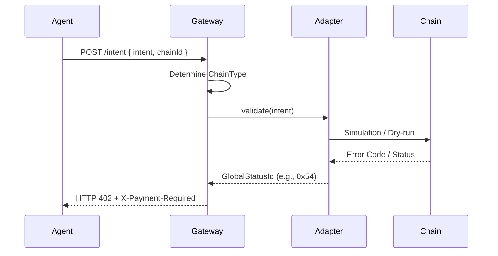

# Multi-Chain Architecture: ERC-1066-x402

The HyperKit framework is designed to be network-agnostic, providing a unified intent and status layer across heterogeneous blockchains.

## Cross-Chain Abstraction Layer

The system achieves multi-chain support through three key components:

1.  **Global Status Spec**: Standardized status IDs (e.g., 84 for Insufficient Funds) used across all chains.
2.  **On-Chain Adapters**: Thin smart contracts (EVM), programs (Solana), or modules (Sui) that map runtime-specific errors to the global spec.
3.  **Gateway Adapters**: Off-chain middleware that handles chain-specific RPC calls and simulation/dry-runs to extract status codes.

## Chain-Specific Mappings

### EVM (Ethereum, L2s)
- **Encoding**: `bytes1`
- **Mechanism**: `view` functions returning status codes.
- **Verification**: `eth_call` (readContract).

### Solana (Anchor)
- **Encoding**: `u16`
- **Mechanism**: `ProgramError::Custom(status)`
- **Verification**: `simulateTransaction`. The Gateway parses the simulation logs to find the custom error code.

### Sui (Move)
- **Encoding**: `u64`
- **Mechanism**: `abort status`
- **Verification**: `dryRunTransactionBlock`. The Gateway extracts the abort code from the transaction effects.

## Intent Routing

When an agent sends an intent to the Gateway, the following flow occurs:

