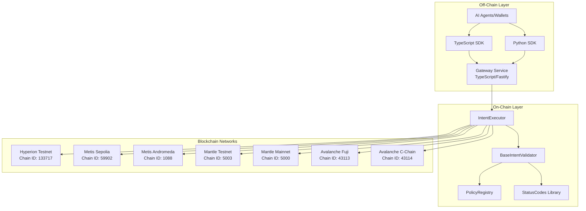
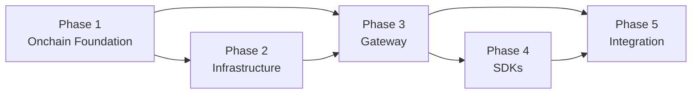

# Overview
This plan implements the complete ERC-1066-x402 system: onchain smart contracts with testing, TypeScript gateway service, TypeScript/Python SDKs, and multi-chain deployment infrastructure. The system standardizes status codes, policy checks, and intent validation for Web3 transactions with HTTP/x402 gateway integration.

**Network-Agnostic Design**: The gateway uses [Chainlist](https://chainlist.org) for automatic RPC discovery, supporting any EVM-compatible chain without hardcoding network configurations. See [Network-Agnostic Architecture](../architecture/NETWORK_AGNOSTIC.md) for details.

# Architecture Overview

# Dependencies Between Phases

