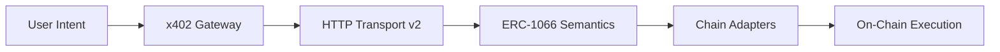

# ERC-1066-x402 Specifications

This directory contains the formal technical specifications for the ERC-1066-x402 protocol stack. These specifications ensure interoperability between AI agents, payment gateways, and multi-chain smart contracts.

## Versioning

| Version | Status | Description |
| :--- | :--- | :--- |
| **[v1 (Legacy)](./v1/TRANSPORT.md)** | 🏛️ Legacy | Original flat JSON response with custom HTTP headers. |
| **[v2 (Latest)](./v2/TRANSPORT.md)** | 🚀 Latest | Alignment with Coinbase x402 v2 standard and multi-chain support. |

## Core Specifications (Latest v2)

| Spec | Description | Status |
| :--- | :--- | :--- |
| **[TRANSPORT](./v2/TRANSPORT.md)** | HTTP 402 transport layer alignment with x402 v2 | ✅ Final |
| **[SCHEMES](./v2/SCHEMES.md)** | Payment fulfillment schemes (Exact, On-chain) | ✅ Final |
| **[SEMANTICS](./v2/SEMANTICS.md)** | ERC-1066 Status Code definitions and mapping | ✅ Final |
| **[PROTOCOLS](./v2/PROTOCOLS.md)** | Multi-chain implementation (EVM, Solana, Sui) | ✅ Final |

## Protocol Overview

ERC-1066-x402 provides a unified semantic layer for Web3 intents. It combines the structured status codes of **ERC-1066** with the machine-readable payment requests of **x402** to enable fully autonomous AI agent transactions.

## Implementation Guidelines

- **Agents**: Should parse the `accepts` array in 402 responses to identify supported payment schemes.
- **Gateways**: Must map on-chain execution failures to the appropriate ERC-1066 status codes.
- **Contracts**: Should follow the `StatusCodes.sol` (EVM), `status.rs` (Solana), or `intent_framework.move` (Sui) implementations for code consistency.
